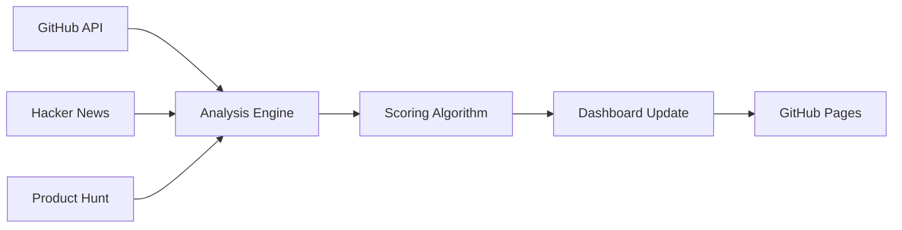

<div align="center">

# � Early-Stage GitHub Signals

**Investor-grade radar for high-potential open-source projects**

Discover promising developer tools and infrastructure projects before they hit mainstream — powered by real-time momentum analysis across GitHub, Hacker News, and Product Hunt.

[](https://cdolik.github.io/early-stage-github-signals/)

[](https://github.com/cdolik/early-stage-github-signals/actions)
[](https://cdolik.github.io/early-stage-github-signals/)
[](https://opensource.org/licenses/MIT)
[](https://cdolik.github.io/early-stage-github-signals/api/latest.json)

---

### 🎯 **Perfect for VCs, Angels & Tech Leaders**
*Find tomorrow's infrastructure unicorns while they're still in stealth*

</div>

## ✨ What Makes This Special

🔍 **Early Detection** — Spots momentum before mass adoption  
📊 **Data-Driven** — 10-point scoring algorithm, not gut feelings  
⚡ **Real-Time** — Updated weekly with fresh market signals  
🎨 **Investor-Ready** — Clean dashboard built for decision makers  

> **"Like ProductHunt for developer infrastructure, but focused on momentum signals that actually predict success."**

---

## 🚀 Quick Start

### **[👀 View Live Dashboard →](https://cdolik.github.io/early-stage-github-signals/)**

**Or run locally:**
```bash
git clone https://github.com/cdolik/early-stage-github-signals.git
cd early-stage-github-signals
make serve
```

---

## 🧮 How It Works

### **The 10-Point Momentum Score**

Our algorithm analyzes 4 key momentum indicators:

| Signal | Weight | What It Measures |
|--------|--------|------------------|
| **📈 Commit Surge** | 3 pts | 10+ commits in 14 days with feature work |
| **⭐ Star Velocity** | 3 pts | Rapid GitHub star accumulation |
| **👥 Team Traction** | 2 pts | Multi-contributor momentum (2-5 devs) |
| **🛠️ Dev-Tool Fit** | 2 pts | Developer infrastructure relevance |

### **Why These Signals Matter**
- **Commit patterns** reveal active development vs. abandonware
- **Star velocity** indicates market resonance and word-of-mouth
- **Team growth** suggests sustainable development vs. solo projects
- **DevTool focus** filters for infrastructure opportunities

---

## 💼 Use Cases

<table>
<tr>
<td width="50%">

### **🏦 For VCs & Angels**
- **Early deal flow** — Discover before your competition
- **Technical due diligence** — Validate team execution
- **Market timing** — Track emerging technology trends
- **Portfolio monitoring** — Watch competitive landscapes

</td>
<td width="50%">

### **👩‍💻 For Tech Leaders**
- **Technology scouting** — Find cutting-edge tools
- **Competitive intelligence** — Monitor similar projects
- **Hiring signals** — Identify talented teams
- **Open source strategy** — Spot collaboration opportunities

</td>
</tr>
</table>

---

## 🛠️ Technical Stack

<div align="center">

**Frontend:** Pure HTML/CSS/JS • **Backend:** Python • **Hosting:** GitHub Pages  
**CI/CD:** GitHub Actions • **Data:** GitHub API + Hacker News + Product Hunt

</div>

---

## ⚙️ Development

### **Quick Setup**
```bash
# Install dependencies
make install

# Run dashboard locally  
make serve

# Generate fresh data
make generate

# Run test suite
make test
```

### **CLI Options**

| Flag | Purpose |
|------|---------|
| `--debug` | Enable debug logging |
| `--max-repos N` | Limit analysis to N repositories |
| `--min-stars N` | Minimum stars for consideration |
| `--skip-hackernews` | Skip Hacker News data collection |
| `--skip-producthunt` | Skip Product Hunt data collection |

---

## 📁 Project Structure

```
📦 early-stage-github-signals
├── 📂 src/                    # Core analysis engine
│   ├── 📂 analyzers/          # Scoring algorithms
│   ├── 📂 collectors/         # Data gathering
│   └── 📂 generators/         # Report output
├── 📂 docs/                   # GitHub Pages dashboard
│   ├── 📄 index.html          # Interactive dashboard
│   ├── 📄 dashboard.js        # Frontend logic
│   └── 📂 api/                # JSON data endpoints
├── 📂 schemas/                # Data validation
└── 📂 scripts/                # Automation tools
```

---

## 🔄 How Data Flows



**Every Monday:** Fresh data → Analysis → Updated dashboard → Deployed automatically

---

## 🏗️ Architecture

### **Data Collection**
- **GitHub API**: Repository metrics, commits, contributors
- **Hacker News**: Community discussion signals  
- **Product Hunt**: Product launch momentum

### **Scoring Engine**
- **Momentum Analysis**: Velocity calculations across time windows
- **Team Dynamics**: Contributor growth and collaboration patterns
- **Market Fit**: Developer tool categorization and ecosystem relevance

### **Output Generation**
- **Interactive Dashboard**: Real-time filtering and exploration
- **JSON API**: Programmatic access to scored repositories
- **Weekly Reports**: Markdown summaries for easy sharing

---

## 🤝 Contributing

We welcome contributions that improve signal quality and dashboard usability:

### **Ways to Contribute**
- **Algorithm improvements**: Better momentum detection
- **Data sources**: Additional signal inputs
- **Dashboard features**: Enhanced filtering and visualization  
- **Documentation**: Clearer setup and usage guides

### **Development Process**
```bash
# Fork & clone the repository
git clone your-fork-url
cd early-stage-github-signals

# Install development dependencies
pip install -r requirements-dev.txt

# Make your changes
# ... code changes ...

# Run tests
python -m pytest tests/

# Submit a pull request
```

---

## � API Reference

### **Live Data Endpoints**

| Endpoint | Description |
|----------|-------------|
| [`/api/latest.json`](https://cdolik.github.io/early-stage-github-signals/api/latest.json) | Current scored repositories |
| [`/api/simplified.json`](https://cdolik.github.io/early-stage-github-signals/api/simplified.json) | Minimal dataset for integrations |

### **Sample Response**
```json
{
  "generated_at": "2025-01-13T12:00:00Z",
  "total_repositories": 156,
  "repositories": [
    {
      "id": "owner/repo-name",
      "name": "Awesome DevTool",
      "score": 8.7,
      "signals": {
        "commit_surge": 0.9,
        "star_velocity": 0.8,
        "team_traction": 0.7,
        "dev_ecosystem_fit": 0.8
      },
      "metrics": {
        "stars": 1247,
        "forks": 89,
        "contributors": 4,
        "recent_commits": 23
      }
    }
  ]
}
```

---

## 🔒 Privacy & Ethics

- **Public Data Only**: Analysis uses publicly available GitHub data
- **No Personal Info**: Focus on repository metrics, not individual developers
- **Transparent Methodology**: Open-source algorithm for community review
- **Rate Limiting**: Respectful API usage within GitHub's terms

---

## 📄 License

MIT License - see [LICENSE](LICENSE) for details.

Built with ❤️ for the startup ecosystem.

---

<div align="center">

### 🌟 **Like what you see?**

[](https://github.com/cdolik/early-stage-github-signals)
[](https://github.com/cdolik/early-stage-github-signals/subscription)

**[🚀 Explore the Dashboard](https://cdolik.github.io/early-stage-github-signals/)** • **[📁 Browse Source](https://github.com/cdolik/early-stage-github-signals)** • **[📈 View API](https://cdolik.github.io/early-stage-github-signals/api/latest.json)**

</div>
