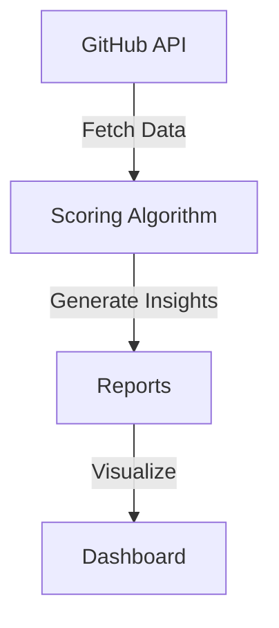

# 🚀 Early-Stage GitHub Signals


[](https://cdolik.github.io/early-stage-github-signals/) [](LICENSE)

Discover early-stage startups with data-driven insights. Explore trends, scores, and reports to make informed investment decisions.

---

## 🌟 **Live Dashboard**

[](https://cdolik.github.io/early-stage-github-signals/)


---

## 🎯 **Key Features**

- 🎯 **50-point scoring algorithm**: Evaluate startups with precision.
- 📊 **Interactive dashboard**: Filter and sort repositories effortlessly.
- 🤖 **Automated weekly reports**: Stay updated with the latest insights.
- 📈 **Trend analysis**: Identify emerging technologies and startups.
- ⚡ **Real-time GitHub API integration**: Always up-to-date data.

---

## ⚡ **Quick Start**

1. Clone the repository:
   ```bash
   git clone https://github.com/cdolik/early-stage-github-signals.git
   ```
2. Install dependencies:
   ```bash
   pip install -r requirements.txt
   ```
3. Set up environment variables:
   ```bash
   export GITHUB_API_TOKEN=your_token_here
   ```
4. Run the application locally:
   ```bash
   python run.py
   ```

---

## 🛠️ **Architecture**



---

## 💼 **For VCs**

### **Why Use Early-Stage GitHub Signals?**
- **Discover Hidden Gems**: Identify promising startups early.
- **Data-Driven Decisions**: Leverage insights for smarter investments.
- **Stay Ahead**: Monitor trends and emerging technologies.

### **Sample Insights**
- **Top Scored Startups**: Fintech API, Test Startup
- **Trending Technologies**: AI, Blockchain, SaaS

---

## 📚 **API Documentation**

### **Endpoints**
- `/api/latest.json`: Latest startup scores and insights.

### **Example Response**
```json
{
  "repositories": [
    {
      "name": "test-startup",
      "score": 45,
      "language": "Python"
    },
    {
      "name": "fintech-api",
      "score": 50,
      "language": "JavaScript"
    }
  ]
}
```

---

## 🤝 **Contributing**

### **Add New Scoring Criteria**
1. Modify `src/analyzers/startup_scorer.py`.
2. Add tests in `tests/test_integration.py`.

### **Development Setup**
1. Install dependencies:
   ```bash
   pip install -r requirements.txt
   ```
2. Run tests:
   ```bash
   pytest
   ```

---

## ❤️ **Footer**

Built with ❤️ for startup discovery.

- [Live Dashboard](https://cdolik.github.io/early-stage-github-signals/)
- [API Documentation](https://cdolik.github.io/early-stage-github-signals/api/latest.json)
- [Reports](https://cdolik.github.io/early-stage-github-signals/reports/)
